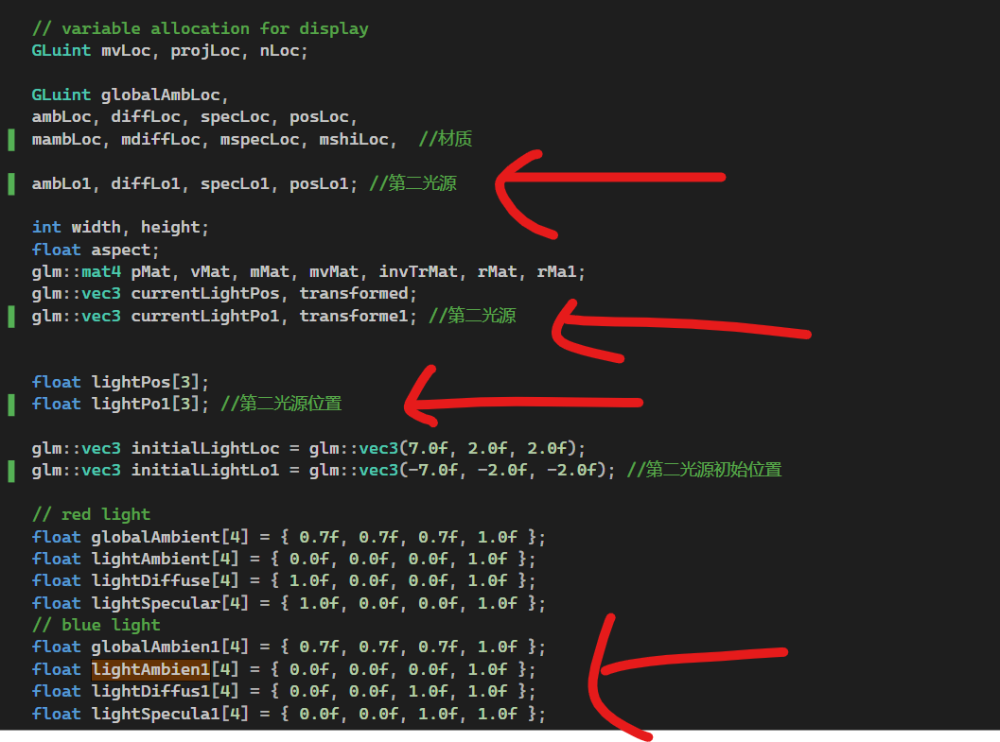
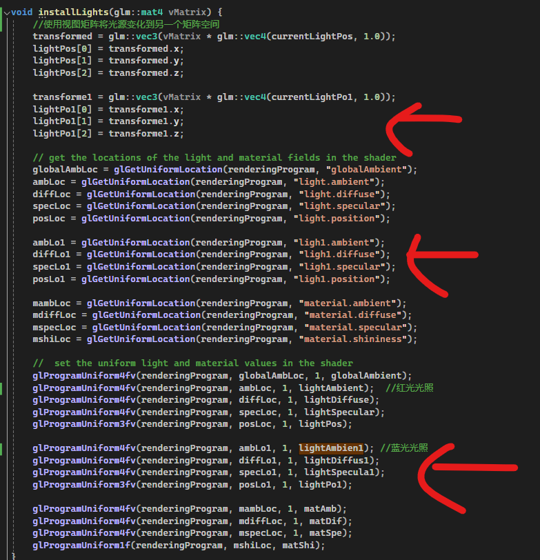
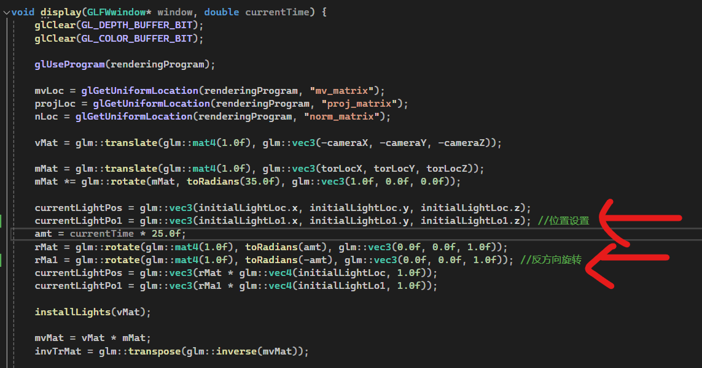
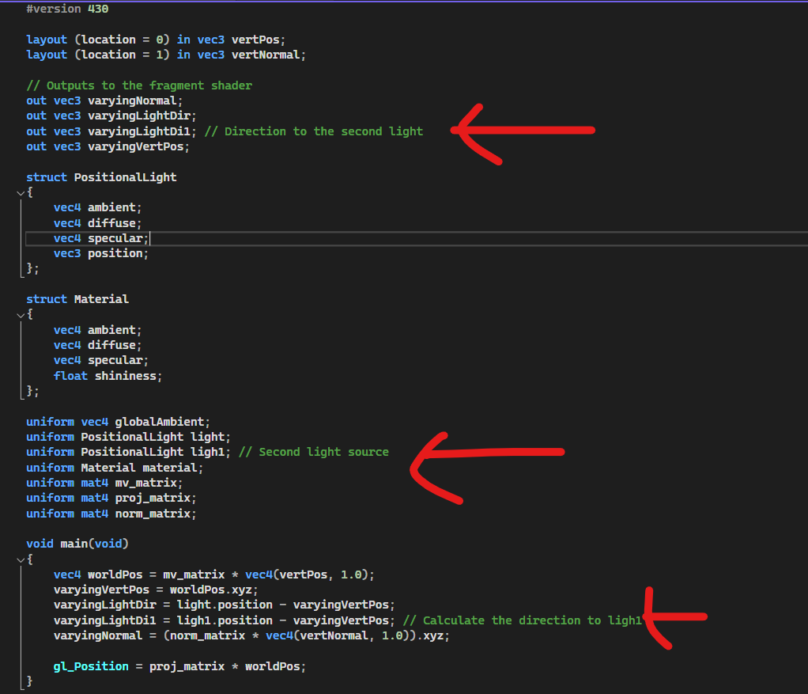
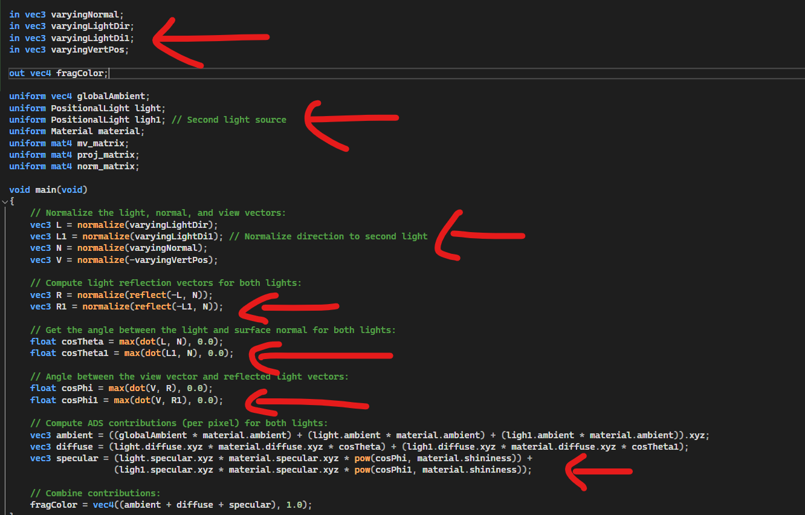
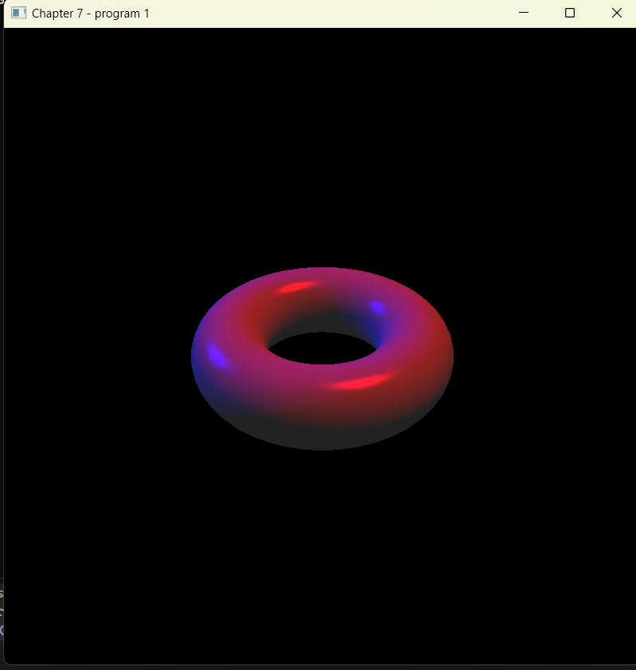

# 计算机图形学 实验报告 Lab4
作者：陈靖辉 时间：2024.4.25

---
### 实验要求
代码、程序界面、报告都很专业 (bonus)

---
### 上机任务
1. 修改程序 7.2 以使其包括两个位于不同位置的位置光，其中一
个是蓝光，另外一个是红光。
2. 片段着色器需要混合每个光的漫反射和镜面反射分量。可以尝
试简单地将它们加起来或者加权求和，并限制结果不超出光照
值的上限。
3. 撰写实验报告，报告中应包含完成任务的核心代码（注意不要
大段复制粘贴代码），运行结果的屏幕截图以及必要的讨论分
析。打包上传实验报告和原始代码，注意代码只需
要.h、.cpp、.glsh以及3D模型和纹理图片文件，不要包含Visual 
Studio工程文件以及 生成的临时文件。
4. 将压缩包上传到http://xzc.cn/SWhktJ3RU5 作业提交截止时间4
月30日23:59

---
## 修改流程


#### 设置第二个光源的位置和颜色
对于当前任务，我们需要参照原先的光源，构造第二个光源






#### 添加对应变量入两个着色器文件
顶点着色器

片段着色器


#### 修改步骤（省略源代码已有部分）
代码讲解部分
#### main函数当中与着色器变量的互动
在光照函数当中，需要有两个与缓冲区互动的步骤

```cpp
// get the locations of the light and material fields in the shader
globalAmbLoc = glGetUniformLocation(renderingProgram, "globalAmbient");
ambLoc = glGetUniformLocation(renderingProgram, "light.ambient");
diffLoc = glGetUniformLocation(renderingProgram, "light.diffuse");
specLoc = glGetUniformLocation(renderingProgram, "light.specular");
posLoc = glGetUniformLocation(renderingProgram, "light.position");

ambLo1 = glGetUniformLocation(renderingProgram, "ligh1.ambient");
diffLo1 = glGetUniformLocation(renderingProgram, "ligh1.diffuse");
specLo1 = glGetUniformLocation(renderingProgram, "ligh1.specular");
posLo1 = glGetUniformLocation(renderingProgram, "ligh1.position");
```
`light`和`ligh1`分别对应获取顶点着色器的两个uniform变量
`glGetUniformLocation`可用于传递颜色、变换矩阵、光照参数等数据。
```cpp
//  set the uniform light and material values in the shader
glProgramUniform4fv(renderingProgram, globalAmbLoc, 1, globalAmbient);
glProgramUniform4fv(renderingProgram, ambLoc, 1, lightAmbient);  //红光光照
glProgramUniform4fv(renderingProgram, diffLoc, 1, lightDiffuse);
glProgramUniform4fv(renderingProgram, specLoc, 1, lightSpecular);
glProgramUniform3fv(renderingProgram, posLoc, 1, lightPos);

glProgramUniform4fv(renderingProgram, ambLo1, 1, lightAmbien1); //蓝光光照
glProgramUniform4fv(renderingProgram, diffLo1, 1, lightDiffus1);
glProgramUniform4fv(renderingProgram, specLo1, 1, lightSpecula1);
glProgramUniform3fv(renderingProgram, posLo1, 1, lightPo1);
```
作用是让两个光照与顶点互动
`glProgramUniform4fv`用于直接设置着色器程序中uniform变量的值
#### 光源旋转
```cpp
currentLightPos = glm::vec3(initialLightLoc.x, initialLightLoc.y, initialLightLoc.z);
currentLightPo1 = glm::vec3(initialLightLo1.x, initialLightLo1.y, initialLightLo1.z); //位置设置
amt = currentTime * 25.0f;
rMat = glm::rotate(glm::mat4(1.0f), toRadians(amt), glm::vec3(0.0f, 0.0f, 1.0f));
rMa1 = glm::rotate(glm::mat4(1.0f), toRadians(-amt), glm::vec3(0.0f, 0.0f, 1.0f)); //反方向旋转
currentLightPos = glm::vec3(rMat * glm::vec4(initialLightLoc, 1.0f));
currentLightPo1 = glm::vec3(rMa1 * glm::vec4(initialLightLo1, 1.0f));
```
注意，要使光源旋转，需要改变的是`toRadians()`函数，后面那个参数是用来设置旋转围绕的轴。


### 结果图

---
## 实验收获：

__学习和应用多光源__
通过本次实验，我首次尝试在同一个场景中设置两个独立的光源，并对它们的属性如颜色、强度和位置进行了控制。实验中一个光源发出红光，另一个发出蓝光，这使得整个场景呈现出非常独特和有趣的视觉效果。通过对每个光源的漫反射和镜面反射分量进行混合和加权求和，我得以观察到不同光源设置对物体表面影响的变化，这增强了我的光照处理能力。

__着色器的灵活应用__
在本次实验中，修改和应用顶点着色器和片段着色器是一个挑战。我学习了如何传递多个光源信息给着色器，并在着色器中编写代码来处理这些信息。通过这种方式，我能够控制场景中不同光源的影响，使我对着色器编程的理解更加深刻。

__代码结构和组织__
在进行实验的过程中，我意识到良好的代码结构和注释的重要性。为了使代码清晰和易于理解，我花了额外的时间来优化代码结构并添加了详尽的注释。这不仅帮助我在编写时保持思路清晰，也使得其他人（包括教师和同学们）能够更容易地理解我的工作。
__实践与理论的结合__
通过这次实验，我将课堂上学到的理论知识应用于实践中，特别是在光照模型和着色器的具体应用上。这种实践经验是非常宝贵的，它不仅加深了我对图形学概念的理解，还提高了我解决实际问题的能力。

---