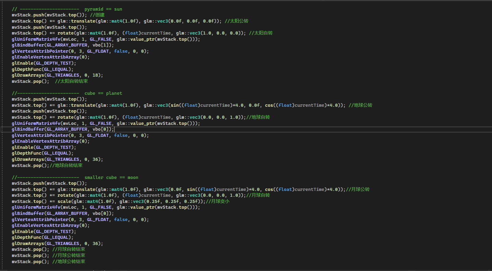
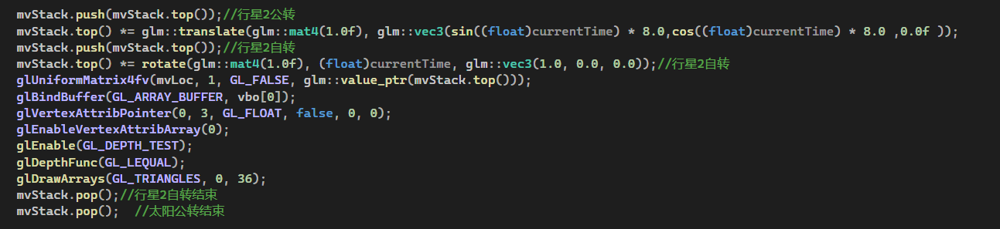
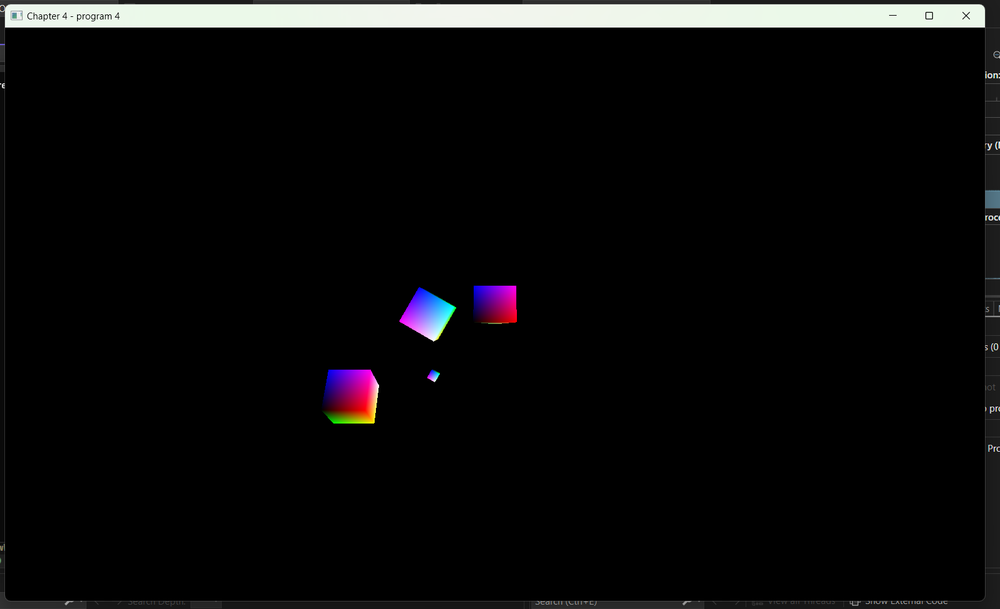
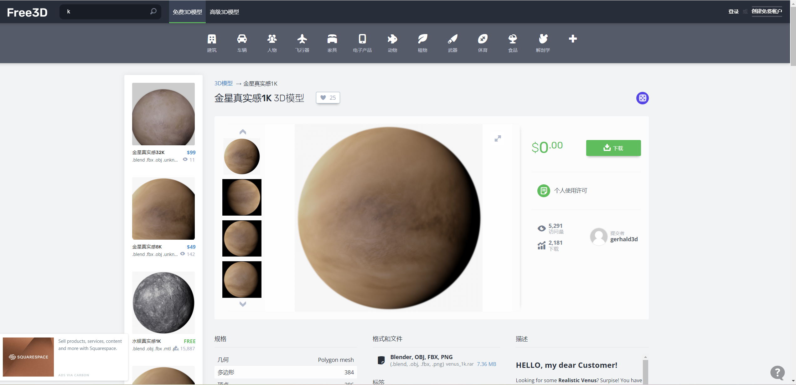
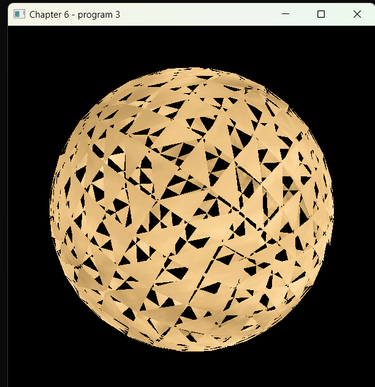
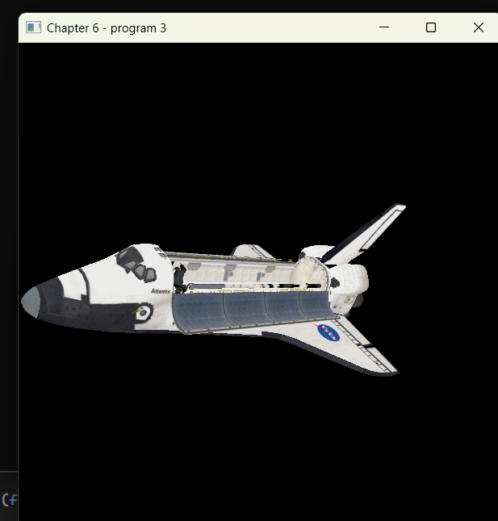
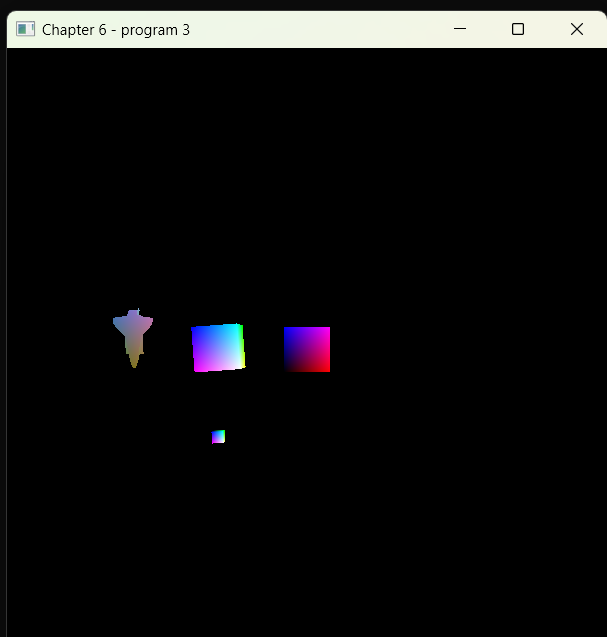

# 计算机图形学 实验报告 Lab2 
--- 
作者：陈靖辉 时间：2024.3.29
---
### 实验要求
代码、程序界面、报告都很专业 (bonus)
---
### 上机任务
1. 修改程序 4.4 以包含第二个“行星”，使用你自定义的 3D 形
状。
2. 实现“行星”公转自转动画效果，确保你的新“行星”处于与
地球不同的轨道上，使得它们不会碰撞。
3. 撰写实验报告，报告中应包含完成任务的核心代码（注意不要
大段复制粘贴代码），运行结果的屏幕截图以及必要的讨论分
析。打包上传实验报告和原始代码，注意代码中不要包含
Visual Studio 生成的临时文件。
4. 将压缩包上传到http://xzc.cn/yDUKk3SkOo 作业提交截止时间4
月2日23:59
---
## 修改流程
当我第一次看到这个程序的时候，我对程序旋转的栈结构理解不够深刻，而且对于图形旋转矩阵理解不够
在我上完课程以及观看书本相关章节之后，我终于理解了行星公转和自转模型这栈结构实现原理
现在记录我对两者的理解

上图代码我添加了的注释，使其变得更加易于理解
#### 函数解释
首先`glm::translate`函数为图像平移矩阵，在程序设计中将其视作公转的实现方法。
其次`glm::rotate`函数为图像旋转矩阵，在程序设计中将其视作自转的实现方法。
最后`glm::scale`函数为图像缩放矩阵，在程序设计正将其视作制作大小星体的实现方法
#### 自转栈实现原理
1. 对于一个星系，首先定义中心天体的公转，太阳不公转，使用`mat4(1.0f)，glm::vec3(0.0f, 0.0f, 0.0f)`单位矩阵表示
2. 向栈里添加一个元素模拟太阳自转，使用` (float)currentTime,glm::vec3(1.0, 0.0, 0.0)`表示随时间自转，当太阳自转后将其退出栈表示自转结束。
3. 定义行星的公转，在太阳公转未结束时使用`glm::vec3(sin((float)currentTime)*4.0, 0.0f, cos((float)currentTime)*4.0)`表示地球在这个圆周位于x-z平面上旋转，沿y轴垂直。
4. 定义行星自转，添加一个元素使用` glm::vec3(0.0, 0.0, 1.0)`表示行星绕着z轴旋转，随后退出栈表示自转结束
5. 定义卫星公转，在行星公转未结束时添加一个元素使用`glm::vec3(0.0f, sin((float)currentTime)*4.0, cos((float)currentTime)*4.0)`表示卫星在y-z平面上，沿着x轴旋转。
6. 定义卫星自转，在卫星公转为结束时添加一个元素使用`(float)currentTime, glm::vec3(0.0, 0.0, 1.0)`表示卫星绕着z轴旋转。
7. 卫星和星星使用相同的模型，但是卫星需要使用`scale(glm::mat4(1.0f), glm::vec3(0.25f, 0.25f, 0.25f))`表示卫星比行星小
8. 卫星自转公转结束，退出三个元素，分别表示卫星自转结束，公转结束，行星公转结束
#### 添加第二行星实现

1. 第二行星和第一行星地位相同，都是在太阳自转结束后添加元素，所以使用`translate(glm::vec3(sin((float)currentTime) * 8.0,cos((float)currentTime) * 8.0 ,0.0f)`表示随时间公转，在x-y平面上绕着z轴旋转，与第一行星轨道不同。
2. 添加元素使用`rotate(glm::mat4(1.0f), (float)currentTime, glm::vec3(1.0, 0.0, 0.0))`表示第二行星绕着x轴旋转
3. 两次退出分别表示行星2和太阳公转结束
#### 最后实现图：

#### 使用自定义3d图形
再提前预习第六章内容：3d模型
学习了obj文件加载功能和`ModelImporter`与`ImportedModel`类之后，我决定把第二行星替换为如下模型

首先导入两个头文件`"ImportedModel.cpp" `,    `"ImportedModel.h" `

但是很明显哪里出错了，我决定直接使用自带的航天飞机更方便

头文件
添加`#include "stack"`
复制
`void setupVertices(void) `
复制
`init  shuttleTexture = Utils::loadTexture("spstob_1.jpg")`
修改fragshader文件：
讲texture改成varyingColor，似乎同时使用texture和自定义颜色比较麻烦，所以我跳过了
### 成功！！！！
