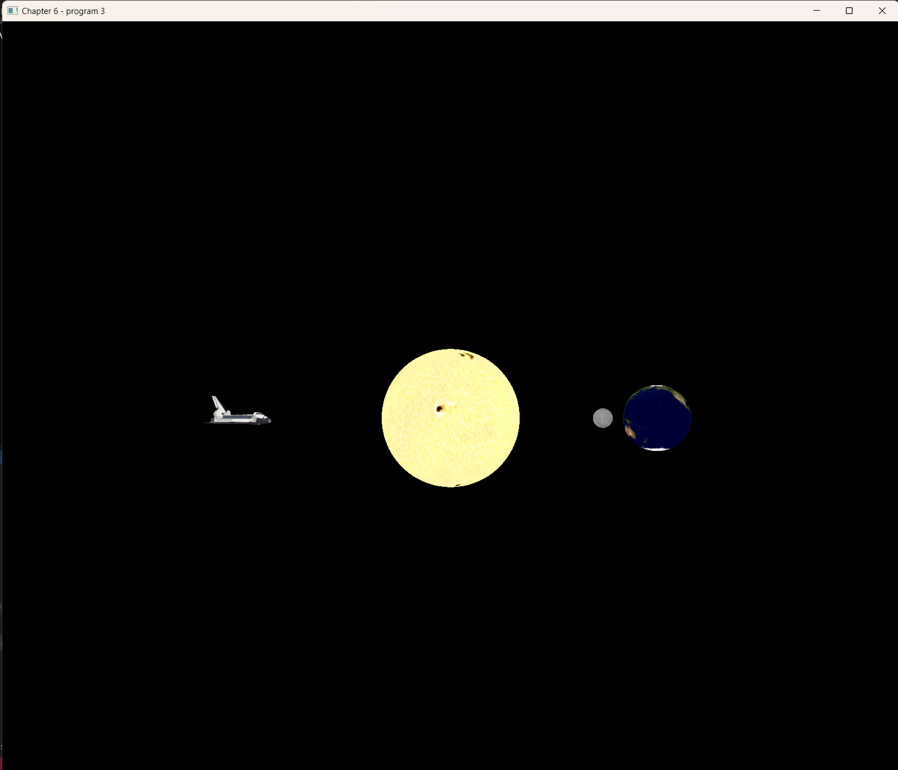

# 计算机图形学 实验报告 Lab3
作者：陈靖辉 时间：2024.4.7

---
### 实验要求
代码、程序界面、报告都很专业 (bonus)

---
### 上机任务
1. 修改程序 4.4 ，使“太阳”“地球”“月球”成为带纹理的球
体。
2. 导入的 NASA 航天飞机对象也绕“太阳”运行。对航天飞机引
用适当的缩放和旋转，使其看起来更逼真。
3. 撰写实验报告，报告中应包含完成任务的核心代码（注意不要
大段复制粘贴代码），运行结果的屏幕截图以及必要的讨论分
析。打包上传实验报告和原始代码，注意代码只需
要.h、.cpp、.glsh以及3D模型和纹理图片文件，不要包含Visual 
Studio工程文件以及 生成的临时文件。
4. 将压缩包上传到http://xzc.cn/IrPLa96o2L 作业提交截止时间4月
16日23:59

---
### 修改流程


#### 寻找基础文件：
对于当前任务，我们一共有三个文件可以选择作为基础的修改文件，分别是
1. 程序4.4 三角形 和 正方形模拟太阳系星系运转


2. 程序6.1 地球球形纹理模型


3. 程序6.3 航天飞机加载obj纹理模型


__我决定在6.3文件上进行修改，原因如下__
- 最终代码需要出现航天飞机，可以直接复用源代码
- 对于球模型和太阳系模型容易添加修改

#### 修改步骤（省略源代码已有部分）

1. 添加头文件，资源文件，导入图片


2. 修改main函数，导入与修改如下文件和变量

```cpp
#include <stack>
#include "Sphere.h"
```

```cpp
#define numVBOs 10 //添加vbo的数量，可以容纳球和纹理图片

GLuint shuttleTexture;
GLuint earthTexture; //添加地球月球太阳纹理图片
GLuint moonTexture;
GLuint summap;

Sphere mySphere = Sphere(48);//导入球体模型vbo
stack<glm::mat4> mvStack; //构建太阳系模拟堆栈
```
3. 修改setupVertices函数，构建vbo文件
```cpp
void setupVertices(void) {
	vert.clear();//数据清空
	tex.clear();
	norm.clear();
	vert = mySphere.getVertices();//加载球模型数据
	tex = mySphere.getTexCoords();
	norm = mySphere.getNormals();

	std::vector<float> _pvalues;//新建模型数据
	std::vector<float> _tvalues;
	std::vector<float> _nvalues;
	std::vector<int> ind = mySphere.getIndices();
	vert = mySphere.getVertices();
	tex = mySphere.getTexCoords();
	norm = mySphere.getNormals();
	int numIndices = mySphere.getNumIndices();
	for (int i = 0; i < numIndices; i++) {
		_pvalues.push_back((vert[ind[i]]).x);
		_pvalues.push_back((vert[ind[i]]).y);
		_pvalues.push_back((vert[ind[i]]).z);
		_tvalues.push_back((tex[ind[i]]).s);
		_tvalues.push_back((tex[ind[i]]).t);
		_nvalues.push_back((norm[ind[i]]).x);
		_nvalues.push_back((norm[ind[i]]).y);
		_nvalues.push_back((norm[ind[i]]).z);
	}
    //对球模型vbo空间开辟
	glBindBuffer(GL_ARRAY_BUFFER, vbo[3]);
	glBufferData(GL_ARRAY_BUFFER, _pvalues.size() * 4, &_pvalues[0], GL_STATIC_DRAW);

	glBindBuffer(GL_ARRAY_BUFFER, vbo[4]);
	glBufferData(GL_ARRAY_BUFFER, _tvalues.size() * 4, &_tvalues[0], GL_STATIC_DRAW);

	glBindBuffer(GL_ARRAY_BUFFER, vbo[5]);
	glBufferData(GL_ARRAY_BUFFER, _nvalues.size() * 4, &_nvalues[0], GL_STATIC_DRAW);
}

```
4. init函数加载纹理贴图图片
```cpp
    //添加纹理贴图图片
	earthTexture = Utils::loadTexture("earth.jpg"); 
	moonTexture = Utils::loadTexture("moon.jpg");
	summap = Utils::loadTexture("sunmap.jpg");
```

5. 太阳系堆栈结构实现
大部分代码跟4.4差不多
最关键的如下
```cpp
glBindBuffer(GL_ARRAY_BUFFER, vbo[3]);  //修改为vbo[3] 对应第三处修改中开辟的vbo 代表使用的是球形
glBindTexture(GL_TEXTURE_2D, summap); // 绑定特定纹理图片
glDrawArrays(GL_TRIANGLES, 0, myModel.getNumVertices()); // 绘制模型时要使用对应的顶点数
```
纹理贴图绑定不能缺少，不然容易出现贴图错误。
```cpp
glBindBuffer(GL_ARRAY_BUFFER, vbo[4]);
glVertexAttribPointer(1, 2, GL_FLOAT, GL_FALSE, 0, 0);
glEnableVertexAttribArray(1);
```

6. 修改`fragShader.glsl` `vertShader.glsl` 

重点如下

```cpp
layout (location = 0) in vec3 position;
layout (location = 1) in vec2 tex_fj;
```
必须要有两个layout，这才能绑定分别顶点贴图和纹理贴图
之后顶点着色器将结果输出给片段着色器，再使用定义好的纹理采样器s将采样的颜色值赋值给输出变量color

```cpp
layout (binding=0) uniform sampler2D s;
    //略
    color = texture(s,fj);
```
### 附加项——飞机方向
通过旋转函数可以让飞机沿着轨道切线飞行，更加拟真
```cpp
mvStack.top() *= glm::rotate(glm::mat4(1.0f), glm::radians(-90.0f), glm::vec3(0.0f, 1.0f, 0.0f));
```
### 附加项——轨道速度
通过设置 xxx_obit,xxx_speed 等变量，可以快捷控制天体运行轨道和速度参数，便于修改
```cpp
float earth_obbit = 6.0f;
float moon_orbit = 1.5f;
float moon_speed = 4.0f;
float fj_orbit = 8.5f;
float fj_speed = 0.8f;
```

### 结果图


---
## 实验收获：

__理解纹理映射原理__：通过对程序6.3的修改，加深了对纹理映射的理解。了解了如何将纹理映射到模型表面，使得模型具有更加生动逼真的外观。

__学会使用OpenGL绘制带纹理的模型__：通过添加纹理图片、修改顶点数据和着色器代码等步骤，学会了如何在OpenGL中绘制带有纹理贴图的模型。这为后续的计算机图形学相关项目提供了基础。

__掌握堆栈的使用__：实现太阳系模拟时使用了堆栈结构来管理不同天体的变换矩阵，这加深了对堆栈在图形学中的应用理解。堆栈的使用可以有效地管理模型的层次结构，简化了模型的复杂性。

__加深对旋转和缩放的理解__：通过调整航天飞机的旋转和缩放，使其更加逼真地绕着太阳运行，加深了对旋转和缩放变换的理解。这些变换是制作真实感模型的重要技巧。

__实践能力提升__：通过完成实验，提高了对OpenGL编程的实践能力，同时也锻炼了解决问题和调试代码的能力。


---