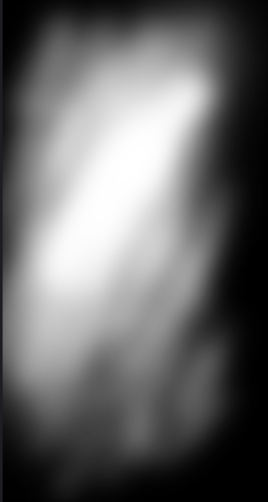
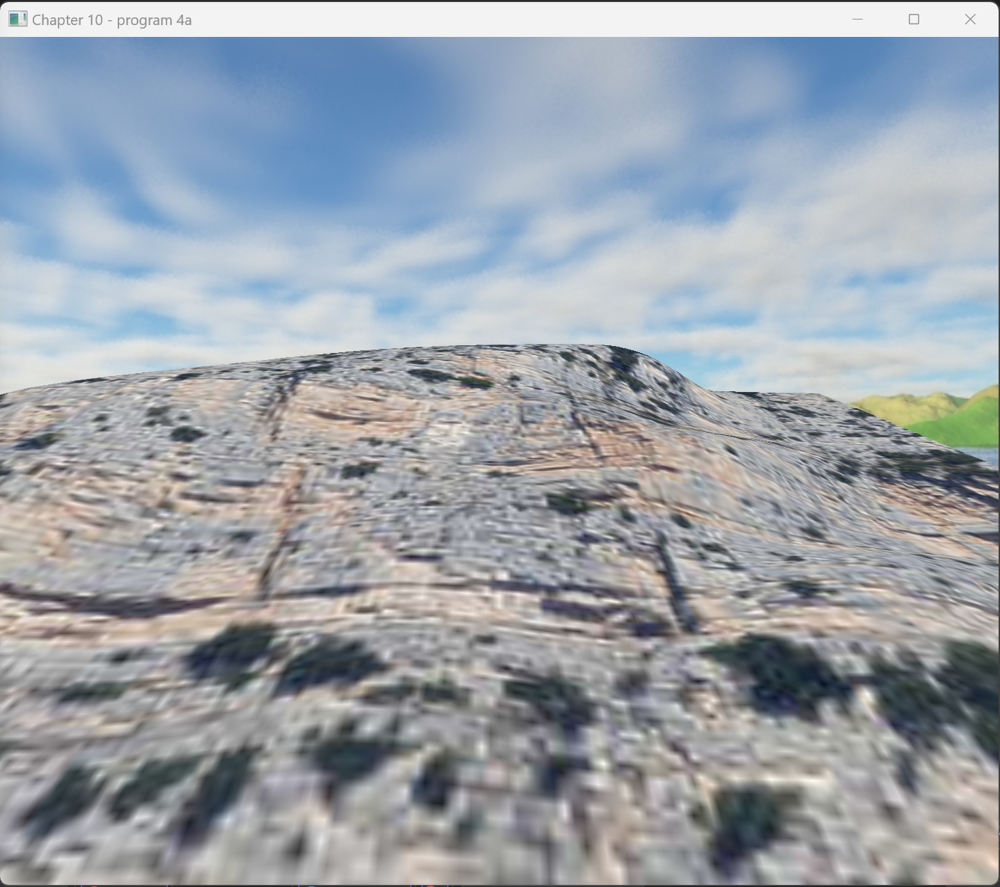

# 计算机图形学 实验报告 Lab5
作者：陈靖辉 时间：2024.5.28

---
### 实验要求
代码、程序界面、报告都很专业 (bonus)

---
### 上机任务
1. 使用任意画图软件生成一份地形高度图，并在程序 10.4 中使
用它。
2. 为地形模型贴上合适的纹理贴图。
3. 利用天空盒为场景添加背景。
4. 撰写实验报告，报告中应包含完成任务的核心代码（注意不要
大段复制粘贴代码），运行结果的屏幕截图以及必要的讨论分
析。打包上传实验报告和原始代码，注意代码只需
要.h、.cpp、.glsh以及3D模型和图片文件，不要包含Visual 
Studio工程文件以及 生成的临时文件。
5. 将压缩包上传到http://xzc.cn/tQJqxN6onj 作业提交截止时间5
月28日23:59
---

#### 1. 生成地形高度图

首先，使用 Photoshop 生成了一份地形高度图，该图用于模拟地形的高低起伏。



#### 2. 为地形模型贴上合适的纹理贴图

使用 `SOIL2` 库加载纹理贴图，并应用于地形模型：

```cpp
heightTexture = Utils::loadTexture("RockMountain.jpg");
heightMap = Utils::loadTexture("mountains.jpeg");
```

#### 3. 利用天空盒为场景添加背景

加载天空盒纹理并设置为背景：

```cpp
skyboxTexture = Utils::loadTexture("lakeIslandSkyBox.jpg");
```

#### 4. 核心代码讲解

##### 设置地形模型的顶点数据

从导入的模型中获取顶点、纹理坐标和法线数据，并将其存储在相应的缓冲区中：

```cpp

...省略

glGenVertexArrays(1, vao);
glBindVertexArray(vao[0]);
glGenBuffers(numVBOs, vbo);

glBindBuffer(GL_ARRAY_BUFFER, vbo[0]);
glBufferData(GL_ARRAY_BUFFER, pvalues.size() * 4, &pvalues[0], GL_STATIC_DRAW);

glBindBuffer(GL_ARRAY_BUFFER, vbo[1]);
glBufferData(GL_ARRAY_BUFFER, tvalues.size() * 4, &tvalues[0], GL_STATIC_DRAW);

glBindBuffer(GL_ARRAY_BUFFER, vbo[2]);
glBufferData(GL_ARRAY_BUFFER, nvalues.size() * 4, &nvalues[0], GL_STATIC_DRAW);
```

##### 初始化窗口和加载资源

在 `init` 函数中，初始化窗口和加载所需的纹理资源：

```cpp
void init(GLFWwindow* window) {
    renderingProgram = Utils::createShaderProgram("vertShader.glsl", "fragShader.glsl");
    cameraX = 0.03f; cameraY = 0.03f; cameraZ = 0.6f;
    gndLocX = 0.0f; gndLocY = 0.0f; gndLocZ = 0.0f;

    glfwGetFramebufferSize(window, &width, &height);
    aspect = (float)width / (float)height;
    pMat = glm::perspective(1.0472f, aspect, 0.1f, 1000.0f);

    setupVertices();

    heightTexture = Utils::loadTexture("RockMountain.jpg");
    heightMap = Utils::loadTexture("mountains.jpeg");
    skyboxTexture = Utils::loadTexture("lakeIslandSkyBox.jpg");
}
```

##### 显示函数

在 `display` 函数中，设置投影和视图矩阵，绑定纹理并绘制地形和天空盒：

```cpp
void display(GLFWwindow* window, double currentTime) {

...省略
    glBindBuffer(GL_ARRAY_BUFFER, vbo[3]);
    glVertexAttribPointer(0, 3, GL_FLOAT, GL_FALSE, 0, 0);
    glEnableVertexAttribArray(0);

    glBindBuffer(GL_ARRAY_BUFFER, vbo[4]);
    glVertexAttribPointer(1, 2, GL_FLOAT, GL_FALSE, 0, 0);
    glEnableVertexAttribArray(1);

    glActiveTexture(GL_TEXTURE0);
    glBindTexture(GL_TEXTURE_2D, skyboxTexture);

    glEnable(GL_CULL_FACE);
    glFrontFace(GL_CCW);
    glDisable(GL_DEPTH_TEST);
    glDrawArrays(GL_TRIANGLES, 0, 36);
    glEnable(GL_DEPTH_TEST);
    
    glUseProgram(renderingProgram);
...省略
    glBindBuffer(GL_ARRAY_BUFFER, vbo[0]);
    glVertexAttribPointer(0, 3, GL_FLOAT, GL_FALSE, 0, 0);
    glEnableVertexAttribArray(0);

    glBindBuffer(GL_ARRAY_BUFFER, vbo[1]);
    glVertexAttribPointer(1, 2, GL_FLOAT, GL_FALSE, 0, 0);
    glEnableVertexAttribArray(1);

    glBindBuffer(GL_ARRAY_BUFFER, vbo[2]);
    glVertexAttribPointer(2, 3, GL_FLOAT, GL_FALSE, 0, 0);
    glEnableVertexAttribArray(2);

    glActiveTexture(GL_TEXTURE0);
    glBindTexture(GL_TEXTURE_2D, heightTexture);

    glActiveTexture(GL_TEXTURE1);
    glBindTexture(GL_TEXTURE_2D, heightMap);

    glEnable(GL_CULL_FACE);
    glFrontFace(GL_CCW);
    glEnable(GL_DEPTH_TEST);
    glDepthFunc(GL_LEQUAL);

    glDrawArrays(GL_TRIANGLES, 0, numGroundVertices);
}
```

#### 5. 实验运行结果

下图展示了程序运行后的结果，包括地形高度图的应用、纹理贴图以及天空盒的效果：



### 讨论与分析

在本次实验中，通过加载地形高度图和纹理贴图，成功生成了一个模拟真实地形的 3D 场景。同时，利用天空盒技术为场景添加了自然的背景，提高了视觉效果的真实感。在实现过程中，主要难点在于正确加载和应用纹理，以及确保光照计算的准确性。通过调试和优化，最终实现了预期效果。

### 结论

本次实验通过对地形高度图、纹理贴图和天空盒的综合应用，成功构建了一个真实感较强的 3D 场景，展示了计算机图形学在场景渲染中的重要作用。未来，可以进一步优化光照模型和纹理细节，提高场景的真实感

和表现力。

